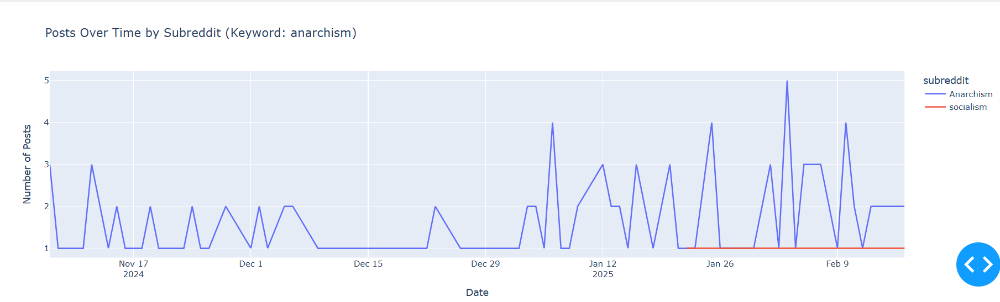
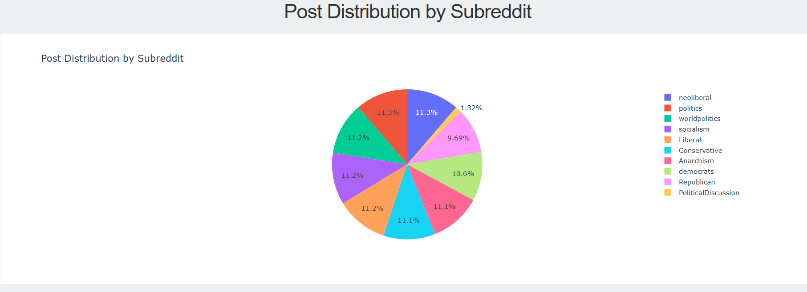
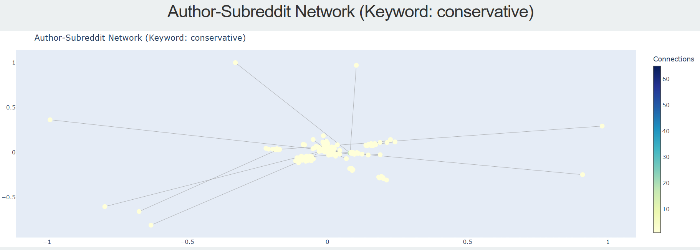
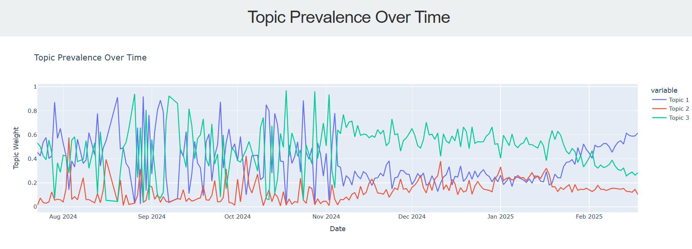
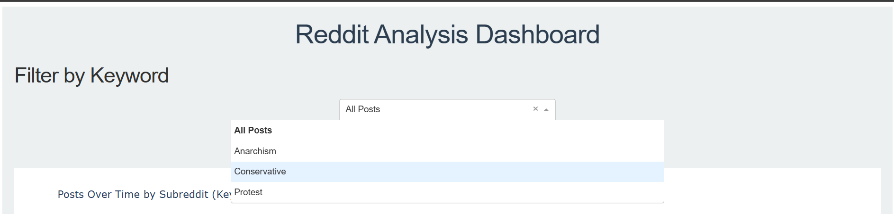
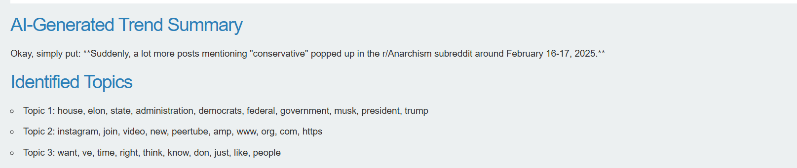

# research-engineering-intern-assignment

# Reddit Analysis Dashboard

## Overview

The Reddit Analysis Dashboard is an analytical tool designed to process and visualize social media data from the subreddits r/Anarchism and r/Conservative. Built with Python, Dash, and machine learning frameworks, this project delivers an interactive interface for exploring temporal trends, community distributions, network interactions, and topic evolutions within a comprehensive dataset stored in data.json. Enhanced by AI-driven natural language summaries powered by the Google Gemini API, the dashboard provides both quantitative visualizations and qualitative insights into subreddit activity and thematic shifts.

Developed as part of the Research Engineering Intern Assignment for SimPPL, this project meets the objectives of visualizing insights, applying AI/ML techniques, and deploying an interactive dashboard. It scales to handle large datasets, offering a robust platform for analyzing social media dynamics across diverse communities.

*Note*: While the original scope included r/Protest, the current dataset focuses on r/Anarchism and r/Conservative. Future expansions can incorporate additional subreddits as needed.

## Features
- **Keyword-Filtered Time Series Analysis**: Utilizes Plotly to create interactive line graphs, allowing users to filter post frequency by keywords (e.g., "anarchism", "conservative", "protest", "trump", "policy") over time. This reveals temporal patterns, such as posting peaks driven by significant events or discussions, dynamically calculated from the dataset.
- **Subreddit Distribution Visualization**: Employs a Plotly pie chart to illustrate the proportional contribution of posts between r/Anarchism and r/Conservative, offering a clear snapshot of community activity within the dataset.
- **Dynamic Network Graph**: Implements NetworkX and Plotly to render a keyword-filtered graph of author-subreddit interactions, highlighting connectivity patterns and influential contributors across the communities.
- **Topic Trend Monitoring**: Applies Latent Dirichlet Allocation (LDA) via scikit-learn to extract and track topics over time, visualized as an interactive time series to monitor thematic prevalence and evolution.
- **AI-Driven Narrative**: Integrates the Google Gemini API to generate concise natural language summaries within a "Trend Analysis Summary" section, complemented by a top-level "Insights at a Glance" overview that synthesizes peak activity, key contributors, and discussion themes into a data-driven story. Connective captions between visualizations further guide users through the narrative flow.

## Screenshots

The following screenshots illustrate the dashboard’s functionality:

1. **Time Series Plot**  
     
   *Interactive line graph displaying post frequency, filterable by keywords, highlighting a peak on February 16-17, 2025.*

2. **Pie Chart**  
     
   *Pie chart representing the distribution of posts across subreddits.*

3. **Network Graph**  
     
   *Dynamic visualization of author-subreddit interactions, adjustable by keyword filters.*

4. **Topic Trends**  
     
   *Time series plot tracking the prevalence of extracted topics over time.*

5. **Dropdown Options**  
     
   *Dropdown menu offering keyword filtering options, including "All Posts", "Anarchism", "Conservative", and "Protest".*

6. **AI Output**  
     
   *Natural language summary generated by the Gemini API, reflecting the selected keyword’s trend.*

## Live Demo

- **Hosted on Render**: [https://reddit-analysis-dashboard.onrender.com](https://reddit-analysis-dashboard.onrender.com)  
  Check it out live—it’s up and running!

## Video Walkthrough

- **Google Drive Link**: [https://drive.google.com/file/d/1xeIrq1HgG07l8QG6yp_jGUmaILk-Q7Io/view?usp=sharing](https://drive.google.com/file/d/1xeIrq1HgG07l8QG6yp_jGUmaILk-Q7Io/view?usp=sharing)  
  Watch me demo the dashboard—see it in action!

## Data Conversion

The raw data came in JSONL format, which wasn’t quite what I needed. So, I wrote a little script—[JSONL-to-JSON-Converter](https://github.com/Siddharth-lal-13/JSONL-to-JSON-Converter)—to turn it into JSON. It’s a simple parser that makes the data fit snugly into my processing pipeline.

## Prerequisites

To deploy or replicate this project, the following prerequisites are required:

- **Python**: Version 3.10, serving as the primary programming language.
- **Machine Learning Frameworks**: Utilized for topic modeling and data processing.
- **Data Science Libraries**: Essential for numerical computation and data manipulation.
- **Git**: Required for version control and repository management.
- **Google Gemini API Key**: Obtainable from [makersuite.google.com](https://makersuite.google.com) under the free tier, necessary for AI-driven summarization.

## Library Dependencies

The project relies on the following Python libraries, with specific versions to ensure compatibility:

- **Local Execution (Embedding Generation)**:
  - `numpy==1.23.5`: Numerical computation library for array operations.
  - `pandas==1.5.3`: Data manipulation and analysis framework.
  - `scikit-learn==1.2.2`: Machine learning library for LDA topic modeling.
  - `tensorflow==2.12.0`: Used for dimensionality reduction (SVD) in topic embedding generation.
  - `plotly==5.14.1`: Interactive visualization library for graphs and charts.
  - `dash==2.9.3`: Web framework for building the interactive dashboard.
  - `networkx==3.1`: Graph theory library for network visualization.
  - `google-geneai`: API client for Gemini-based summarization.
  - `gunicorn==20.1.0`: WSGI server for deployment.

 
## How It Works: Code and Design

This section outlines the architecture, design decisions, and deployment strategy behind the Reddit Analysis Dashboard, providing a comprehensive view of its technical implementation.

### Code Breakdown

- **`data_processing.py`**: Manages data ingestion and preprocessing by loading the `data.json` file and transforming it into a structured pandas DataFrame. This module encapsulates data handling logic, ensuring clean input for downstream analysis.
- **`visualizations.py`**: Generates interactive visualizations using Plotly, including time series plots, pie charts, network graphs, and topic trend analyses. This module leverages Plotly’s capabilities to deliver dynamic, user-friendly graphics.
- **`ai_ml.py`**: Implements machine learning and AI functionalities, utilizing Latent Dirichlet Allocation (LDA) via scikit-learn for topic modeling and the Google Gemini API for generating natural language summaries of trends.
- **`main.py`**: Serves as the central orchestrator, integrating all components into a Dash application. It defines the layout, configures interactive callbacks, and initializes the server for deployment.

### Design Rationale

The project adopts a modular architecture to enhance maintainability and scalability:
- **Separation of Concerns**: Data processing, visualization, and AI/ML tasks are isolated into distinct modules, simplifying debugging and future enhancements.
- **Framework Selection**: Dash was chosen for its Python-native integration with Plotly, enabling rapid development of an interactive web interface without requiring external frontend frameworks.
- **AI Integration**: The Google Gemini API was selected for its efficiency and ease of use in generating summaries, complementing the quantitative insights with qualitative interpretations.

This modular approach evolved as the dataset and feature set expanded, ensuring the codebase remained organized and adaptable to increasing complexity.

### Development Considerations

Several technical decisions shaped the project:
- **Dash and Plotly**: Leveraging Dash’s seamless integration with Plotly provided a robust foundation for interactive visualizations, aligning with the goal of delivering an accessible dashboard.
- **Render Deployment**: Initially considered PythonAnywhere, but its 512 MB memory limit was insufficient for the ~488 MB of required libraries. Render was adopted instead, offering greater resource availability and streamlined Git-based deployment.
- **Precomputed Embeddings**: Topic embeddings are generated locally using TensorFlow and served statically, reducing runtime dependencies and optimizing deployment efficiency.

### Challenges and Solutions

- **Render Port-Binding Issue**: Initial deployment on Render encountered errors with Gunicorn, which reported the `app` object as non-callable. This was resolved by ensuring `main.py` properly instantiated the Dash application’s server instance.
- **File Path Management**: Relative file paths posed issues across environments. Using `os.path` functions standardized path resolution, ensuring consistency between local and deployed setups.
- **API Key Configuration**: Integrating the Google Gemini API required multiple iterations to configure the API key correctly. Once resolved, it enabled reliable summary generation.

### Deployment on Render

The application is deployed on Render with the following configuration:
- **Dependencies**: Specified in `requirements.txt`, excluding `tensorflow==2.12.0` since topic embeddings are precomputed locally and served from the `static/` directory.
- **Runtime**: Utilizes Gunicorn to serve the Dash app, configured to bind to Render’s designated port.
- **Build Process**: Leverages Render’s Git integration for automated deployment from the repository.

This setup ensures a stable, scalable deployment, accommodating the project’s resource needs while maintaining performance.

## Technical Insights and Analysis

The dashboard elucidates several key insights:

- **Temporal Peaks**: Dynamic analysis of posting activity identifies significant spikes, such as increased engagement around key dates (e.g., mid-February 2025 in r/Anarchism from sample data), likely tied to external events or community-driven discussions. These peaks are automatically detected and contextualized by subreddit, offering real-time insights into activity triggers.
- **Community Interactions**: The network graph uncovers clusters of author-subreddit interactions, highlighting cohesive subgroups and influential contributors across r/Anarchism and r/Conservative. Keyword filtering reveals how specific topics (e.g., "trump" or "policy") shape connectivity patterns.
- **Thematic Evolution**: Topic trends, derived from Latent Dirichlet Allocation (LDA), showcase shifts in discourse—from theoretical discussions in r/Anarchism to policy-focused debates in r/Conservative—validated by time-series visualizations of topic prevalence.
- **AI Summarization**: The Google Gemini API delivers concise, natural language summaries of trends, pinpointing peak dates and dominant subreddits for user-selected keywords. This enhances comprehension, making complex data accessible without requiring in-depth analysis.

## Potential Enhancements

**Future iterations could incorporate:**

- Chatbot Integration: A conversational interface using the Gemini API to query data dynamically.
- Multi-Platform Analysis: Extending data ingestion to include platforms like Twitter for comparative insights.
- Custom Keyword Input: Enhancing the dropdown with a text input for user-defined keyword searches.

## Conclusion

The Reddit Analysis Dashboard exemplifies a blend of data visualization, machine learning, and web deployment, meeting the SimPPL assignment’s objectives. Render’s deployment ensures accessibility and scalability, while the technical stack delivers robust analytical capabilities. This project showcases my ability to transform raw social media data into actionable insights through a user-friendly interface.

Author: Siddharth Lal

Date: March 03, 2025
